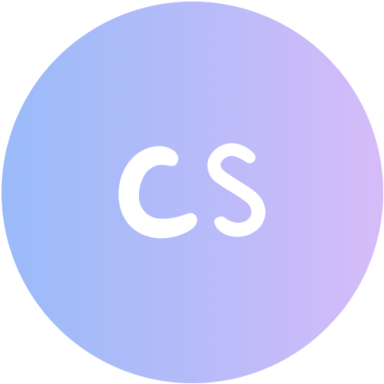
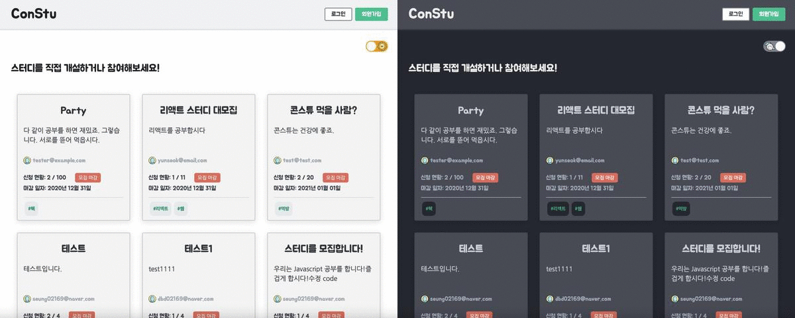
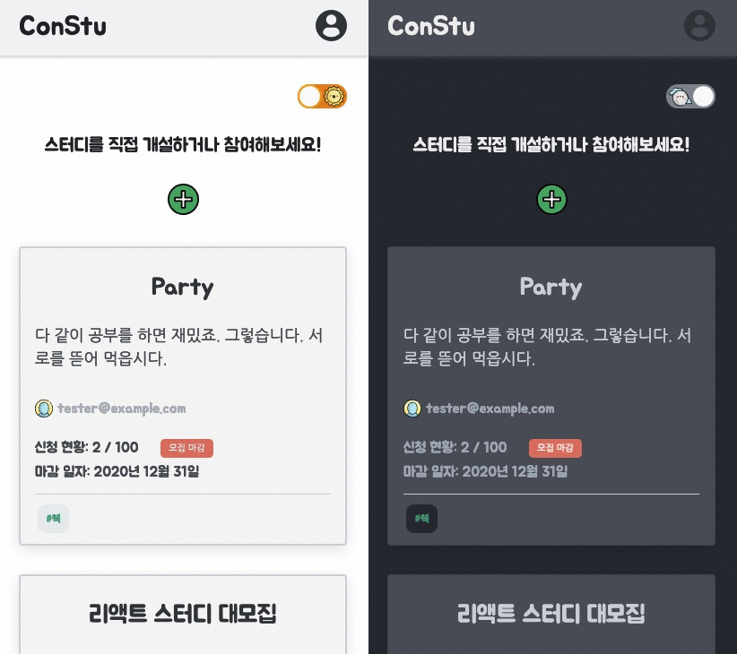

#  ConStu (Connect to Study, 스터디를 잇다)


<a href="https://github.com/CodeSoom/ConStu/actions?query=workflow%3ACI">
  
</a>

<a href="https://github.com/CodeSoom/ConStu/actions?query=workflow%3ACD">
  
</a>

<a href="https://codecov.io/gh/CodeSoom/ConStu">
  
</a>

<a href="https://github.com/CodeSoom/ConStu/actions?query=workflow%3ACI">
  
</a>

<a href="https://github.com/CodeSoom/ConStu/issues">
  
</a>

<a href="https://github.com/CodeSoom/ConStu/blob/main/LICENSE">
  
</a>

## 🚀 Hosting URL

https://sweet-1cfff.firebaseapp.com

## 🎈 사용 목적 및 소개
- 네? 뭐라고요??🙋‍♂️ 스터디를 찾고 있다구요?🤔 스터디에 관한 정보는 모두 여기에!!
- 개발과 관련한 또는 IT와 관련된 스터디를 찾고 같이 공부하고 소통하고 싶을 때 사용합니다.
- 이 프로젝트는 프론트앤드 개발에 집중하기 위해 백앤드 구현을 최소화하였고, 그에 따라 firebase를 사용하였습니다.
- 2021.06.10(목) 기준으로 316개의 단위 테스트와 Code Coverage는 99.6% 이고 41개의 e2e 테스트 시나리오가 존재합니다.

## 💻 Project Structure

```
📦src
 ┣ 📂 assets
 ┃ ┣ 📂 css
 ┃ ┗ 📂 icons
 ┣ 📂 components
 ┃ ┣ 📂 auth
 ┃ ┣ 📂 base
 ┃ ┣ 📂 common
 ┃ ┣ 📂 introduce
 ┃ ┃ ┣ 📂 modals
 ┃ ┣ 📂 loader
 ┃ ┣ 📂 main
 ┃ ┗ 📂 write
 ┣ 📂 containers
 ┃ ┣ 📂 auth
 ┃ ┣ 📂 base
 ┃ ┣ 📂 groups
 ┃ ┣ 📂 introduce
 ┃ ┗ 📂 write
 ┣ 📂 pages
 ┣ 📂 reducers
 ┣ 📂 services
 ┣ 📂 styles
 ┣ 📂 util
 ┃ ┣ 📂 config
 ┃ ┣ 📂 constants
 ┣ 📜 App.jsx
 ┣ 📜 App.test.jsx
 ┗ 📜 index.jsx
```

## 👉 개발 기간
- 2020.11.16 ~ 2020.12.13 (1달)
- **계속해서 기능 추가 중..** [:link:](https://github.com/CodeSoom/ConStu/issues/115)

## 🚀 프로젝트 주 차별 계획 및 회고

|👉 주차|계획|회고|
|:---:|:---:|:---:|
|1 주차|[:link:](https://github.com/CodeSoom/ConStu/issues/1)|[:link:](https://github.com/saseungmin/codesoom_code_review_repository/tree/master/week_9)|
|2 주차|[:link:](https://github.com/CodeSoom/ConStu/issues/20)|[:link:](https://github.com/saseungmin/codesoom_code_review_repository/tree/master/week_10)|
|3 주차|[:link:](https://github.com/CodeSoom/ConStu/issues/44)|[:link:](https://github.com/saseungmin/codesoom_code_review_repository/tree/master/week_11)|
|4 주차|[:link:](https://github.com/CodeSoom/ConStu/issues/77)|[:link:](https://github.com/saseungmin/codesoom_code_review_repository/tree/master/week_12)|

## 🎯 코드숨 후기 및 전체 회고

- [전체 회고](https://github.com/saseungmin/codesoom_code_review_retrospective)

<a href="https://velog.io/@saseungmin/%EC%BD%94%EB%93%9C%EC%88%A8-2%EA%B8%B0-%EA%B7%B8-3%EB%8B%AC%EA%B0%84%EC%9D%98-%EC%97%AC%EC%A0%95">
  
</a>

</br>

<a href="https://haranglog.tistory.com/23">
  
</a>


## ✌️ 진행 사항 및 참고 사항
- [진행 사항](https://github.com/CodeSoom/ConStu/issues/115)
- [react-draft-wysiwyg editor 에 대한 버그 사항](https://github.com/CodeSoom/ConStu/issues/108)
- [Firebase api키에 대한 참고 사항](https://github.com/CodeSoom/ConStu/issues/133)

## 📚 Project Settings

#### 📢 Install npm dependencies

```bash
> npm install
```
#### 📢 Start dev-server

```bash
> npm start
```

#### 📢 Run tests

- Run unit test and e2e test

```bash
> npm test
```

- unit test
```bash
> npm run test:unit
```

- Run e2e test

```bash
> npm run test:e2e
```

#### 📢 Run build project

```bash
> npm build
```

#### 📢 Run Lint

```bash
> npm run lint
```

#### 📢 Run Coverage

```bash
> npm run coverage
```

- 자세한 사항은 `package.json`의 `scripts` 참고

## 📚 Getting start with firebase
- [Firebase](https://firebase.google.com/)
- [Docs](https://firebase.google.com/docs/cli?hl=ko)

#### 📢 firebase API키 관리
- [Firebase API 키 관리에 대한 참고 사항](https://github.com/CodeSoom/project-react-2-saseungmin/issues/133)
- [Firebase API 키에 대해서 작성한 블로그 글](https://haranglog.tistory.com/25)

#### 📢 Initial firebase setup

- Install firebase-tools

```bash
> npm install -g firebase-tools
```

- Login to firebase

```bash
> firebase login
```

- Deploy with firebase hosting
```bash
> firebase deploy
```

## 🔥 기술 스택 및 사용 라이브러리
- React
- Redux, Redux-Toolkit, Redux-Thunk
- React Router Dom
- React Helmet
- React Use
- Emotion, facepaint, react-responsive
- Firebase, FireStore
- Jest, React Testing Library, CodeceptJS
- Webpack, Eslint, Babel
- Immer
- Moment, React-moment
- draft-js, react-draft-wysiwyg
- react-content-loader

## 🦄 Demo Image

#### 👉 DeskTop



#### 👉 Mobile


